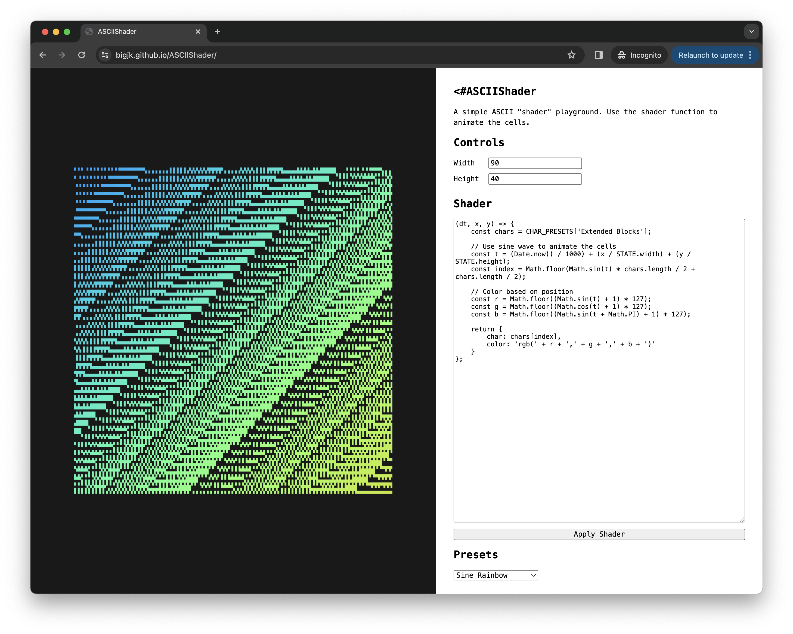

# ASCIIShader



ASCII art tool inspired by fragment shader. [Try it yourself!](https://bigjk.github.io/ASCIIShader/)

## What it does

It's very simple. ASCIIShader takes a function that calculates the character and color of a single cell. So it's a bit like a fragment shader. This can be used to create some pretty dynamic patterns / artworks!

```js
(dt, x, y) => {
  // dt : delta time since last frame
  // x  : cell x position
  // y  : cell y position

  // expects a return with a character and the color of the cell
  // all valid css color strings are valid here
  return { char: '#', color: 'rgb(100, 100, 100)' }
}
```

#### ``STATE``

This global variable can be used to get the width and height:
- ``STATE.width``
- ``STATE.height``

#### ``CHAR_PRESETS``

This global variable can be used to access some common charsets:

```
const CHAR_PRESETS = {
    'Simple': [ /* ... */ ],
    'Basic Blocks': [ /* ... */ ],
    'Extended Blocks': [ /* ... */ ],
}
```
